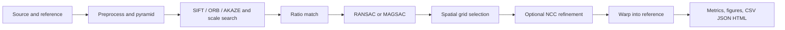
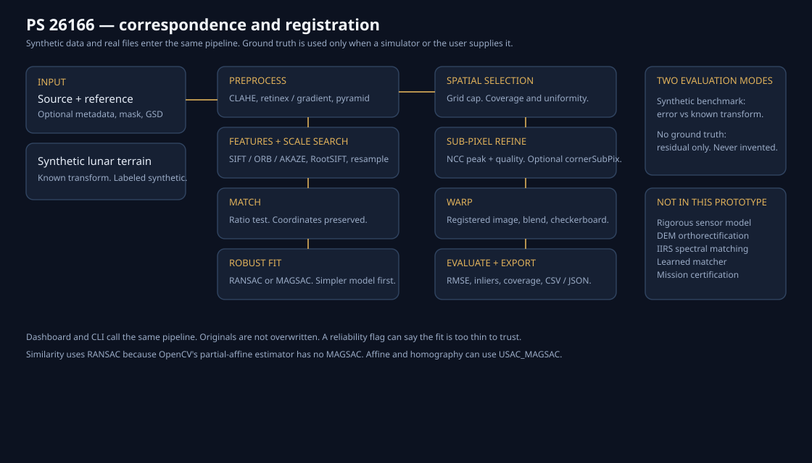

# Lunar correspondence — SIH PS 26166

A local research prototype for **Problem Statement 26166**:

> Multi-modal, sun angle and scale invariant image correspondence using Chandrayaan-2 optical images (OHRC, TMC-2 and IIRS).

Organization: Indian Space Research Organisation (ISRO).

This is **not** an ISRO product, not a certified registration system, and not evidence that the method works on all Chandrayaan-2 data. It is a modular pipeline you can run on a synthetic lunar-like pair immediately, and on real OHRC / TMC-2 / IIRS / LRO / SELENE files when you have them.

## What the project does

It finds corresponding points between a source lunar image and a reference lunar image, rejects false matches, keeps those points spread across the overlap, estimates a geometric transform, optionally shifts the points using a local correlation peak, and warps the source into the reference frame.

You get:

- the registered source image
- the match points, before and after outlier rejection and after spatial selection
- overlay, checkerboard, and difference views
- RMSE, inlier count, inlier ratio, spatial coverage, and a refinement quality number
- CSV / JSON / HTML export

## Why lunar registration is difficult

The same crater does not look the same in two lunar images.

- **Sun angle.** A wall that is bright in one image is in shadow in the other. Matching brightness is not matching place.
- **Scale.** OHRC samples the surface at a few tens of centimetres. TMC-2 is about 5 m. IIRS is about 80 m. SELENE’s Terrain Camera is about 10 m. LRO NAC is about 0.5 m. The same rim can be a few pixels or a few hundred.
- **Viewpoint.** A fore or aft TMC-2 view, or an oblique OHRC pass, is not the nadir view. A 2D transform is only an approximation.
- **Sensor.** A panchromatic camera and an infrared spectrometer do not record the same contrast. IIRS is a spectrum, not a picture.
- **False matches.** Round craters look like each other. A matcher will happily pair the wrong rims.
- **Clumped matches.** The sharpest crater can attract most of the points. A transform fit only there can still drift everywhere else.

## The cameras, in short

Figures below are the published instrument specifications, not measurements made by this software.

| Instrument | What it is | Resolution, roughly | Swath, roughly |
| --- | --- | --- | --- |
| **OHRC** | Chandrayaan-2 Orbiter High Resolution Camera, panchromatic | 0.25 m at nadir from 100 km; ISRO also quotes 0.32 m | about 3 km |
| **TMC-2** | Chandrayaan-2 Terrain Mapping Camera-2, panchromatic 0.5–0.8 µm, fore / nadir / aft near ±25° | 5 m | 20 km |
| **IIRS** | Chandrayaan-2 Imaging Infrared Spectrometer, 0.8–5 µm, ~20 nm, ~256 bands | 80 m | 20 km |
| **LRO NAC** | Lunar Reconnaissance Orbiter Narrow Angle Camera, a usual reference | about 0.5 m | about 5 km |
| **SELENE TC** | Kaguya Terrain Camera | about 10 m | stereo pushbroom |

Sources: ISRO Chandrayaan-2 payload descriptions and the ISSDC Chandrayaan browse; LROC / LOLA–Kaguya literature for NAC and SELENE TC. Do not treat a synthetic demo as one of these products.

## What correspondence means

A correspondence is a pair of pixel positions, one in the source and one in the reference, that are believed to see the same ground point. The software keeps those coordinates as floating-point numbers. A decimal is not, by itself, sub-pixel accuracy.

## What registration means

Registration estimates a transform from the correspondences and resamples the source into the reference pixel grid. The reference is not modified. The warp is a geometric resample. It is not radiometric calibration, not orthorectification, and not a mosaic with a photometric model.

## How the hard parts are handled

**Scale.** SIFT (the default) and AKAZE search a scale space inside each image. On top of that, the pipeline resamples the source over a list of factors, matches each version, and keeps the factor with the most geometric inliers. Keypoints are mapped back to the working image, so the reported geometric scale is not the resampling factor. If both files have a ground sample distance, that ratio is added as a hint, not as a fact. Image pyramids are built and recorded. A very large scale gap, such as OHRC against IIRS, is outside what this classical matcher should be trusted for.

**Illumination.** CLAHE and percentile normalization reduce global brightness differences. The default feature image is a single-scale retinex (the image minus a wide blur), so slow shading is suppressed and rims remain. Gradient magnitude and difference-of-Gaussians are selectable. SIFT is computed on gradients; RootSIFT (L1-normalize, then square-root) is used for SIFT. If both images carry sun azimuth and elevation, the dashboard shows the difference and prefers retinex when that difference is large. Those angles are **not** turned into a Hapke correction. That would need a DEM and a photometric model, which this prototype does not have. Brightness correlation after the warp is reported only as a description. On the sun-angle demo it is about 0.55, while the geometry is still recovered. Low correlation is not an error.

**Viewpoint.** Similarity (rotation, uniform scale, translation) is the default simple model. Affine covers a mild unequal scale and shear. Homography covers a stronger plane-to-plane view change. Auto mode tries similarity first and keeps a freer model only when reprojection RMSE drops by at least 15% without losing more than 20% of the inliers. None of these replace a camera model. Fore and aft TMC-2 views are not the same geometry as nadir.

**False matches.** Lowe’s ratio test drops ambiguous descriptor pairs. RANSAC, or USAC MAGSAC where OpenCV allows it, then keeps pairs that agree with one transform. OpenCV 4.11 does not implement MAGSAC inside `estimateAffinePartial2D`, so **similarity uses RANSAC**. Affine and homography use MAGSAC when you ask for it. The dashboard says which estimator actually ran.

**Spread of points.** After the robust fit, the overlap is divided into a grid (default 6×6). Each cell keeps only a few of its best inliers, with a minimum spacing. The transform is fit again on that spread-out set. Coverage is the fraction of overlap cells that contain at least one selected point. Uniformity is the normalized entropy of those counts. 1 is even. 0 means every selected point sits in one cell. The spatial figure draws selected points in gold and rejected inliers in red.

**Sub-pixel refinement.** For each selected pair, a small reference patch is correlated inside a source window (`TM_CCOEFF_NORMED`). The correlation peak is interpolated with a parabola. The peak NCC is the quality number. Mean shift is how far the point moved, not an error. `cornerSubPix` is available but refines each image alone, so it can snap to a different rim; it is not the default. A controlled unit test recovers a known 0.5 px shift. On the synthetic lunar pairs below, refinement often **does not** reduce ground-truth localization error. The report says so when that happens. Do not read a decimal coordinate as a claim of sub-pixel lunar accuracy.

## How the metrics are calculated

**Total matches.** Descriptor pairs that passed the ratio test, before geometry.

**Inliers.** Those pairs accepted by RANSAC or MAGSAC within the reprojection threshold (default 3 px).

**Outliers.** Total matches minus inliers.

**Inlier ratio.** `inliers / total matches`.

**RMSE.** For the final model points,

```
e_i = distance between T(source_i) and reference_i
RMSE = sqrt(mean(e_i²))
```

in working-image pixels. These points were already chosen to fit `T`, so RMSE is a **consistency residual**, not an independent check against lunar ground control. Median and maximum residuals are reported the same way.

**Spatial coverage.** Overlap grid cells with at least one selected correspondence, divided by overlap grid cells. The overlap is the valid footprint of the preliminary warp.

**Uniformity.** Shannon entropy of the selected-point counts over the overlap cells, divided by `log(number of cells)`.

**Overlap.** Fraction of reference pixels covered by the warped source.

**Overlap correlation.** Pearson correlation of intensities inside that footprint. Descriptive only.

**Refinement quality.** Mean NCC of the local correlation peaks. Not an accuracy.

**Ground-truth corner RMSE** (synthetic or user-supplied matrix only). The four source corners are mapped by the estimated transform and by the known transform. RMSE of those four differences is the geometric error. Scale, rotation, and translation errors are reported when both transforms are similarity or affine. This is simulator error, or whatever matrix you placed in `ground_truth.json`. It is not a surveyed lunar accuracy.

If no ground-truth file exists, those fields are omitted. They are never filled in with a guess.

**Reliability flag.** `consistent_on_this_pair` means at least 40 inliers and at least 50% coverage. `unreliable` means fewer than 12 inliers, under 15% coverage, a degenerate scale, or a ground-truth corner error above 8 px. Anything else is `marginal`. This is a prototype guard, not a certification.

## Two evaluation modes

| Mode | When | What you may conclude |
| --- | --- | --- |
| `synthetic_benchmark` | The pair was generated here, or a synthetic file has `ground_truth.json` | The estimated transform can be compared with the known one. |
| `user_supplied_ground_truth` | You provided a matrix next to a real file | The comparison is only as good as that file. |
| `no_ground_truth` | Ordinary uploads | Only the residual, inlier ratio, and coverage. No invented accuracy. |

The dashboard banner says which one you are in.

## Synthetic benchmark that was actually run

Command, from this repository, on 2026-09-24:

```bash
python main.py benchmark --size 512 --seeds 7,11
```

Images are 512×512 procedural crater fields. Default config: SIFT, RootSIFT, retinex, ratio 0.80, scale search, MAGSAC where OpenCV supports it, auto model except the affine scenario, 6×6 spatial grid, NCC refinement. Full table: `outputs/benchmark/benchmark.csv`.

| Preset | Seed | Matches | Inliers | Inlier ratio | RMSE (px) | Coverage | GT corner RMSE (px) | Reliability |
| --- | ---: | ---: | ---: | ---: | ---: | ---: | ---: | --- |
| baseline | 7 | 322 | 177 | 55.0% | 1.42 | 97% | 0.97 | consistent |
| baseline | 11 | 366 | 191 | 52.2% | 1.55 | 100% | 0.89 | consistent |
| sun_angle | 7 | 171 | 21 | 12.3% | 1.52 | 42% | 0.67 | marginal |
| sun_angle | 11 | 156 | 26 | 16.7% | 1.48 | 42% | 0.83 | marginal |
| large_scale (0.48×) | 7 | 128 | 57 | 44.5% | 1.22 | 63% | 0.31 | consistent |
| large_scale | 11 | 122 | 56 | 45.9% | 1.66 | 69% | 0.31 | consistent |
| viewpoint_affine | 7 | 217 | 76 | 35.0% | 1.61 | 94% | 0.98 | consistent |
| viewpoint_affine | 11 | 300 | 55 | 18.3% | 1.33 | 64% | 0.81 | consistent |
| cross_sensor simulation | 7 | 85 | 18 | 21.2% | 1.14 | 25% | 2.06 | marginal |
| cross_sensor simulation | 11 | 75 | 13 | 17.3% | 1.72 | 28% | 1.21 | marginal |

Reading that table:

- On the easy similarity pair, corner error is under 1 px and points cover the overlap. That is a simulator result.
- The sun-angle pair (about 54° azimuth, 15° elevation) still recovers the transform, but with few inliers and about 42% coverage. The flag stays marginal on purpose. Intensity correlation is about 0.55, against about 0.88 on the baseline. Brightness is not what carried the match.
- A scale of 0.48 is recovered with corner error about 0.3 px.
- The cross-sensor preset blurs, changes gamma, and adds pushbroom-like stripes. It is **not** an IIRS cube. The fit is thin. Do not describe it as multi-modal spectral registration.
- Localization RMSE after NCC refinement is usually a bit **worse** than before (for example 1.07 px to 1.54 px on baseline seed 7). The refiner is implemented and tested on a known shift. It is not shown to improve these lunar-like pairs.

An extreme sun reversal (azimuth difference near 90° and a low source elevation) was tried during development and produced a false consensus. The reliability flag marked it unreliable. That case is not in the table because the shipped sun-angle preset was kept inside the range this classical matcher can recover. Opposite-side shadows remain a limitation.

## How to run the synthetic demo

```bash
python -m venv .venv
source .venv/bin/activate
pip install -r requirements.txt
python -m pytest
python main.py demo --preset baseline --out outputs/demo_run
streamlit run app/ui/streamlit_app.py --server.address 0.0.0.0 --server.port 8501
```

Other presets: `sun_angle`, `large_scale`, `viewpoint_affine`, `cross_sensor`.

```bash
python main.py generate-demo          # writes data/demo/<preset>/
python main.py benchmark              # writes outputs/benchmark/benchmark.csv
```

The core algorithm does not call the network after the packages are installed. The dashboard may load a font from Google Fonts; if that fails, it falls back to a system font. Registration still runs.

Saved demo files are named `synthetic_*.png` and their JSON says `origin: synthetic`. The banner stays on the synthetic warning if you load them.

## How to use real Chandrayaan-2 or LRO data

1. Download a subset you are allowed to use. Chandrayaan-2 imaging products are distributed by ISRO ISSDC / PRADAN (registration required), for example the [Chandrayaan data browse](https://chmapbrowse.issdc.gov.in/). LRO NAC is at the [LROC PDS site](http://lroc.sese.asu.edu/). SELENE products are at JAXA DARTS.
2. Convert PDS to GeoTIFF with GDAL or ISIS if you can. PNG and JPEG also load.
3. Copy `data/raw/metadata_template.json` next to the image and fill **only** fields you actually know. Delete the rest. Do not invent a sun angle or a GSD.
4. In the dashboard, choose **Upload images**, set the sensor (OHRC, TMC-2, IIRS, Other) and the reference catalog (LRO NAC, SELENE, Other), and run.

A raw `.img` loads only if the sidecar has `width`, `height`, `dtype`, and `offset_bytes`. A multi-band TIFF or cube is reduced to one structural grayscale image. That is not spectral matching. Files that expand past 512 MB in memory are refused with a message asking you to subset them.

`rasterio` is optional. Without it, TIFF pixels still load through `tifffile`, and a GeoTIFF CRS may be incomplete. The message says so. Pixel scale tags are reported only as a partial read.

No real mission pair is included in this repository. There are therefore **no real-lunar-data results** to quote. Do not copy the synthetic table into a slide and call it Chandrayaan-2 performance.

## Architecture





| Path | Role |
| --- | --- |
| `src/io` | Load PNG, JPEG, TIFF, optional GeoTIFF tags, raw sidecar. Missing metadata is allowed. |
| `src/preprocessing` | Grayscale, denoise, CLAHE, retinex, gradient, DoG, pyramid. Originals are kept. |
| `src/features` | SIFT, ORB, AKAZE. A registry exists so a learned matcher could be added. None is bundled, and none is called AI. |
| `src/matching` | Ratio test and explicit scale search. |
| `src/geometry` | Robust fit, model selection, spatial distribution. |
| `src/refinement` | NCC sub-pixel peak, optional `cornerSubPix`. |
| `src/registration` | Warp into the reference frame. |
| `src/evaluation` | Residuals, coverage, ground-truth comparison, formatting. |
| `src/visualization` | Match plots, spatial grid, blend, checkerboard, difference. |
| `src/export` | CSV, JSON, PNG, Markdown, self-contained HTML. |
| `src/demo` | Procedural craters. Labeled synthetic. |
| `app/ui/streamlit_app.py` | Dashboard. |
| `main.py` | `demo`, `register`, `benchmark`, `generate-demo`. |

Configuration lives in `configs/default.yaml`. Paths are resolved from the repository, not from a hard-coded machine path.

## What is implemented, what was demonstrated, what was not

**Implemented.** The full chain in the diagram, three classical detectors, three transform models, spatial selection, optional refinement, two evaluation modes, export, tests, and a dashboard that labels synthetic runs.

**Demonstrated.** On the synthetic benchmark above: similarity, scale 0.48, mild affine, and a moderate sun-angle change. A unit test shows NCC refinement can recover a known half-pixel shift on a clean patch.

**Not demonstrated.** Any real OHRC, TMC-2, IIRS, LRO NAC, or SELENE pair. Sub-pixel improvement on lunar texture. Spectral matching. A sensor model or DEM orthorectification. Operation under every sun angle.

## Limitations

- A 2D similarity, affine, or homography cannot replace a Chandrayaan-2 or LRO sensor model and a lunar DEM.
- Strong shadow reversal still defeats SIFT. The reliability flag is there so a false consensus is not silent.
- IIRS is handled as a structural image. Band ratios, the 3 µm hydration feature, and spectral correspondence are out of scope.
- Repetitive craters cause alias matches. Spatial selection reduces clumping; it cannot invent matches in empty cells.
- RMSE of inliers is optimistic. Quote the ground-truth corner error only for the simulator, and say that you are doing so.
- NCC refinement can lock onto a shadow edge instead of the rim. Watch the localization columns in the benchmark.
- Very large rasters are matched on a working copy (`max_working_side`, default 960). The exported full-resolution matrix accounts for that scale. Warping a full OHRC strip may still be too large for this prototype.
- OpenCV’s similarity estimator is RANSAC, not MAGSAC.

## Tests

```bash
python -m pytest
```

The tests cover transform algebra, the warp direction, spatial de-clustering, metric definitions, missing files, synthetic labeling, a known half-pixel shift, and recovery of the baseline synthetic similarity.

## License

Prototype code in this repository is released under the MIT license for the hackathon prototype. Mission data, if you add it, keeps the provider’s license. ISRO, NASA, and JAXA names are used only to identify the instruments in the problem statement.
